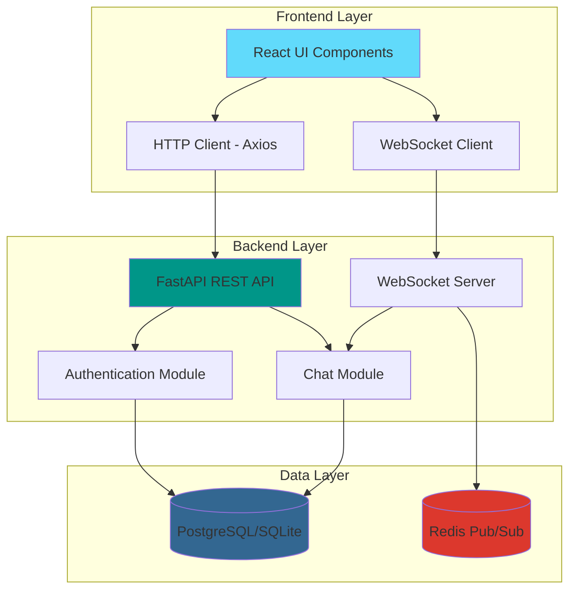
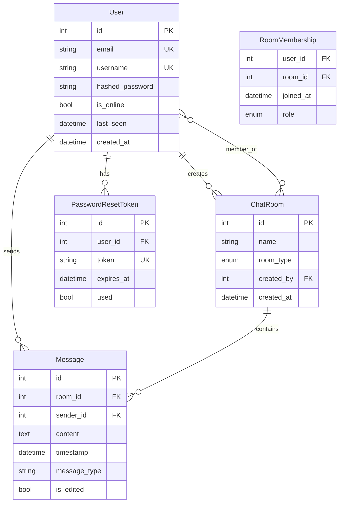

# Design Document

## Overview

The Realtime Chat Server is a full-stack application consisting of a FastAPI backend and React frontend. The backend provides RESTful APIs for authentication and chat management, WebSocket endpoints for real-time messaging, and uses PostgreSQL/SQLite for data persistence with Redis for message broadcasting. The frontend is a React-based single-page application that provides an intuitive interface for users to communicate in real-time.

### Technology Stack

**Backend:**
- FastAPI (Python web framework)
- SQLAlchemy (ORM)
- PostgreSQL/SQLite (database)
- Redis (pub/sub for WebSocket broadcasting)
- JWT (authentication)
- Uvicorn (ASGI server)

**Frontend:**
- React 18+ with TypeScript
- Vite (build tool)
- TailwindCSS (styling)
- WebSocket API (real-time communication)
- React Router (navigation)
- Axios (HTTP client)

## Architecture

### High-Level Architecture



### Backend Architecture

The backend follows a modular architecture with clear separation of concerns:

```
backend/app/
├── api/v1/          # API route aggregation
├── auth/            # Authentication module
│   ├── routes.py    # Auth endpoints
│   ├── schemas.py   # Pydantic models
│   ├── dependencies.py  # Auth dependencies
│   └── password_reset_service.py
├── chat/            # Chat module
│   ├── routes.py    # REST endpoints
│   ├── ws_routes.py # WebSocket endpoints
│   ├── websocket.py # Connection manager
│   └── schemas.py   # Pydantic models
├── core/            # Core configuration
│   ├── config.py    # Settings
│   └── security.py  # JWT & password hashing
├── database/        # Database layer
│   ├── database.py  # SQLAlchemy setup
│   ├── redis_client.py  # Redis connection
│   └── init_db.py   # DB initialization
├── models/          # SQLAlchemy models
│   ├── user.py
│   ├── chat.py
│   └── password_reset.py
└── main.py          # FastAPI application
```

### Frontend Architecture

The frontend follows a component-based architecture:

```
frontend/src/
├── components/      # Reusable UI components
│   ├── auth/        # Auth-related components
│   ├── chat/        # Chat-related components
│   └── common/      # Shared components
├── pages/           # Page components
│   ├── Login.tsx
│   ├── Register.tsx
│   ├── ChatList.tsx
│   └── ChatRoom.tsx
├── services/        # API and WebSocket services
│   ├── api.ts       # HTTP API client
│   └── websocket.ts # WebSocket client
├── hooks/           # Custom React hooks
│   ├── useAuth.ts
│   ├── useChat.ts
│   └── useWebSocket.ts
├── context/         # React context providers
│   ├── AuthContext.tsx
│   └── ChatContext.tsx
├── types/           # TypeScript type definitions
├── utils/           # Utility functions
└── App.tsx          # Main application component
```

## Components and Interfaces

### Backend Components

#### 1. Authentication Module

**Purpose:** Handles user registration, login, session management, and password recovery

**Key Classes:**
- `User` (Model): SQLAlchemy model representing users
- `PasswordResetToken` (Model): Stores password reset tokens
- `PasswordResetService`: Manages password reset logic

**API Endpoints:**
- `POST /api/v1/auth/register` - Register new user
- `POST /api/v1/auth/login` - Authenticate user
- `POST /api/v1/auth/logout` - End session
- `POST /api/v1/auth/refresh` - Refresh JWT token
- `GET /api/v1/auth/me` - Get current user
- `POST /api/v1/auth/password-reset` - Request password reset
- `POST /api/v1/auth/password-reset-confirm` - Confirm password reset

**Security:**
- Passwords hashed using bcrypt
- JWT tokens with 30-minute expiration
- Refresh tokens for session extension
- Token-based password reset with 1-hour expiration

#### 2. Chat Module

**Purpose:** Manages chat rooms, messages, and real-time communication

**Key Classes:**
- `ChatRoom` (Model): Represents chat rooms (one-to-one or group)
- `Message` (Model): Stores chat messages
- `ConnectionManager`: Manages WebSocket connections and broadcasting

**API Endpoints:**
- `GET /api/v1/chat/rooms` - List user's chat rooms
- `POST /api/v1/chat/rooms` - Create new chat room
- `GET /api/v1/chat/rooms/{id}` - Get room details
- `GET /api/v1/chat/rooms/{id}/messages` - Get paginated messages
- `POST /api/v1/chat/rooms/{id}/messages` - Send message (REST)

**WebSocket Endpoints:**
- `WS /ws/chat/{room_id}?token={jwt}` - Real-time chat connection

**Message Broadcasting:**
- Uses Redis pub/sub for scalable message distribution
- ConnectionManager subscribes to room-specific channels
- Messages published to Redis are broadcast to all connected clients

#### 3. Database Layer

**Purpose:** Provides database connectivity and session management

**Components:**
- `get_db()`: Dependency injection for database sessions
- `get_redis()`: Redis client singleton
- Database models with relationships

**Schema:**



### Frontend Components

#### 1. Authentication Components

**LoginForm:**
- Email and password input fields
- Form validation
- Error message display
- Redirects to chat list on success

**RegisterForm:**
- Email, username, and password input fields
- Password confirmation
- Form validation
- Redirects to login on success

**PasswordResetForm:**
- Email input for reset request
- Token and new password for confirmation

#### 2. Chat Components

**ChatRoomList:**
- Displays user's chat rooms
- Shows last message preview
- Online status indicators
- Create new chat button

**ChatRoomView:**
- Message history display
- Real-time message updates
- Message composition input
- Send button
- Auto-scroll to latest message

**MessageBubble:**
- Displays individual message
- Sender username and timestamp
- Different styling for own vs. other messages

**CreateChatModal:**
- User selection for one-to-one or group chat
- Room name input (for groups)
- Member selection interface

#### 3. Layout Components

**Navbar:**
- User profile display
- Logout button
- Online status indicator

**Sidebar:**
- Chat room list
- Search/filter functionality
- Create chat button

### API Client Service

**Purpose:** Centralized HTTP client for backend communication

**Key Functions:**
```typescript
// Authentication
login(email: string, password: string): Promise<TokenResponse>
register(userData: RegisterData): Promise<UserResponse>
logout(): Promise<void>
refreshToken(refreshToken: string): Promise<TokenResponse>
getCurrentUser(): Promise<UserResponse>

// Chat Rooms
getChatRooms(): Promise<ChatRoom[]>
createChatRoom(roomData: CreateRoomData): Promise<ChatRoom>
getRoomDetails(roomId: number): Promise<ChatRoomDetail>
getMessages(roomId: number, page: number): Promise<MessageListResponse>
sendMessage(roomId: number, content: string): Promise<Message>
```

**Features:**
- Automatic JWT token injection
- Token refresh on 401 errors
- Request/response interceptors
- Error handling

### WebSocket Service

**Purpose:** Manages WebSocket connections for real-time messaging

**Key Functions:**
```typescript
connect(roomId: number, token: string): void
disconnect(): void
sendMessage(content: string): void
onMessage(callback: (message: Message) => void): void
onConnect(callback: () => void): void
onDisconnect(callback: () => void): void
onError(callback: (error: Error) => void): void
```

**Features:**
- Automatic reconnection on disconnect
- Message queuing during reconnection
- Connection state management
- Event-based message handling

## Data Models

### Backend Pydantic Schemas

**Authentication:**
```python
class UserCreate(BaseModel):
    email: EmailStr
    username: str
    password: str

class UserLogin(BaseModel):
    email: EmailStr
    password: str

class UserResponse(BaseModel):
    id: int
    email: str
    username: str
    is_online: bool
    last_seen: datetime
    created_at: datetime

class Token(BaseModel):
    access_token: str
    refresh_token: str
    token_type: str
```

**Chat:**
```python
class ChatRoomCreate(BaseModel):
    name: Optional[str]
    room_type: RoomType
    member_ids: List[int]

class MessageCreate(BaseModel):
    content: str
    message_type: str = "text"

class MessageResponse(BaseModel):
    id: int
    room_id: int
    sender_id: int
    content: str
    timestamp: datetime
    message_type: str
    is_edited: bool
    sender_username: Optional[str]

class ChatRoomResponse(BaseModel):
    id: int
    name: Optional[str]
    room_type: RoomType
    created_by: int
    created_at: datetime
    members: List[ChatRoomMember]
    last_message: Optional[MessageResponse]
```

### Frontend TypeScript Types

```typescript
interface User {
  id: number;
  email: string;
  username: string;
  is_online: boolean;
  last_seen: string;
  created_at: string;
}

interface ChatRoom {
  id: number;
  name: string | null;
  room_type: 'one_to_one' | 'group';
  created_by: number;
  created_at: string;
  members: User[];
  last_message?: Message;
}

interface Message {
  id: number;
  room_id: number;
  sender_id: number;
  content: string;
  timestamp: string;
  message_type: string;
  is_edited: boolean;
  sender_username?: string;
}

interface WebSocketMessage {
  type: 'message' | 'typing' | 'user_joined' | 'user_left';
  data: Message | TypingIndicator | UserEvent;
}
```

## Error Handling

### Backend Error Handling

**HTTP Status Codes:**
- `200 OK` - Successful request
- `201 Created` - Resource created successfully
- `400 Bad Request` - Invalid input data
- `401 Unauthorized` - Authentication required or failed
- `403 Forbidden` - Insufficient permissions
- `404 Not Found` - Resource not found
- `500 Internal Server Error` - Server error

**Error Response Format:**
```json
{
  "detail": "Error message describing what went wrong"
}
```

**Common Error Scenarios:**
- Duplicate email/username during registration
- Invalid credentials during login
- Expired JWT token
- Unauthorized room access
- Invalid room member IDs
- WebSocket authentication failure

### Frontend Error Handling

**Error Display:**
- Toast notifications for transient errors
- Inline form validation errors
- Connection status indicators
- Retry mechanisms for failed requests

**Error Recovery:**
- Automatic token refresh on 401
- WebSocket reconnection on disconnect
- Graceful degradation when Redis unavailable
- Offline message queuing

## Testing Strategy

### Backend Testing

**Unit Tests:**
- Authentication logic (password hashing, token generation)
- Password reset service
- Message validation
- Room membership verification

**Integration Tests:**
- API endpoint testing with test database
- WebSocket connection and message flow
- Authentication flow (register → login → access protected endpoint)
- Chat room creation and message sending

**Test Tools:**
- pytest for test framework
- pytest-asyncio for async tests
- httpx for API testing
- SQLAlchemy test fixtures

**Test Coverage Goals:**
- Core business logic: 90%+
- API endpoints: 80%+
- Overall: 75%+

### Frontend Testing

**Unit Tests:**
- Component rendering
- Form validation logic
- Utility functions
- Custom hooks

**Integration Tests:**
- User authentication flow
- Chat room creation
- Message sending and receiving
- WebSocket connection handling

**E2E Tests:**
- Complete user journey (register → login → create room → send message)
- Real-time message synchronization
- Multiple user scenarios

**Test Tools:**
- Vitest for unit tests
- React Testing Library for component tests
- Playwright or Cypress for E2E tests

### Manual Testing

**Functional Testing:**
- All API endpoints via Postman
- WebSocket connections via browser console
- UI interactions in different browsers
- Mobile responsiveness

**Performance Testing:**
- Multiple concurrent WebSocket connections
- Message throughput
- Database query performance
- Redis pub/sub latency

**Security Testing:**
- JWT token validation
- Authorization checks
- SQL injection prevention
- XSS prevention

## Performance Considerations

### Backend Optimization

**Database:**
- Indexed columns: user email/username, message room_id/timestamp
- Eager loading for relationships to avoid N+1 queries
- Pagination for message history
- Connection pooling

**WebSocket:**
- Redis pub/sub for horizontal scalability
- Connection manager for efficient broadcasting
- Async/await for non-blocking operations

**Caching:**
- Redis for session data
- In-memory caching for frequently accessed data

### Frontend Optimization

**Rendering:**
- React.memo for expensive components
- Virtual scrolling for long message lists
- Lazy loading for chat rooms
- Code splitting by route

**Network:**
- Request debouncing for search/filter
- Message batching for WebSocket
- Optimistic UI updates
- Service worker for offline support

**Bundle Size:**
- Tree shaking
- Dynamic imports
- Minification and compression
- CDN for static assets

## Security Considerations

**Authentication:**
- Bcrypt for password hashing (cost factor 12)
- JWT with short expiration (30 minutes)
- Refresh tokens for session extension
- Secure token storage (httpOnly cookies or secure localStorage)

**Authorization:**
- Room membership verification for all chat operations
- User-specific data filtering
- Admin role checks for admin endpoints

**Data Protection:**
- HTTPS for all communications
- WebSocket over WSS in production
- CORS configuration for allowed origins
- Input validation and sanitization

**Rate Limiting:**
- Login attempt limiting
- API request rate limiting
- WebSocket message rate limiting

## Deployment Architecture

**Development:**
- SQLite database
- Local Redis instance
- Uvicorn development server
- Vite dev server with HMR

**Production:**
- PostgreSQL database (managed service)
- Redis cluster (managed service)
- Uvicorn with Gunicorn workers
- Nginx reverse proxy
- React build served via CDN
- Docker containers for backend
- Environment-based configuration

**Scalability:**
- Horizontal scaling via Redis pub/sub
- Load balancer for multiple backend instances
- Database read replicas
- CDN for frontend assets
